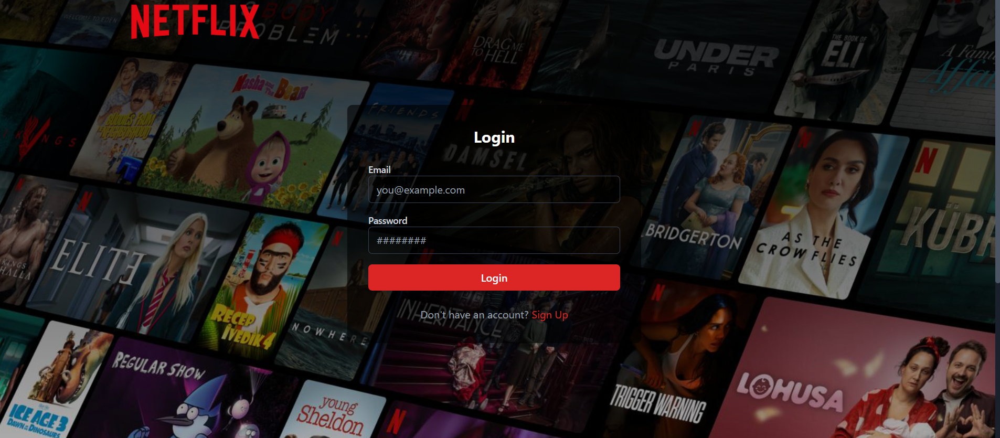
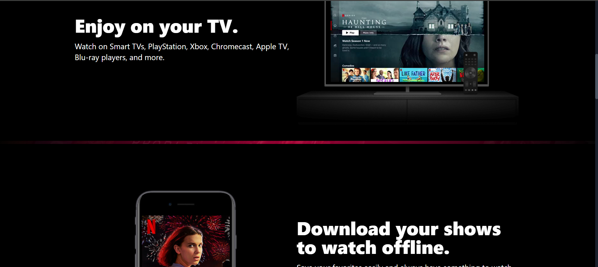
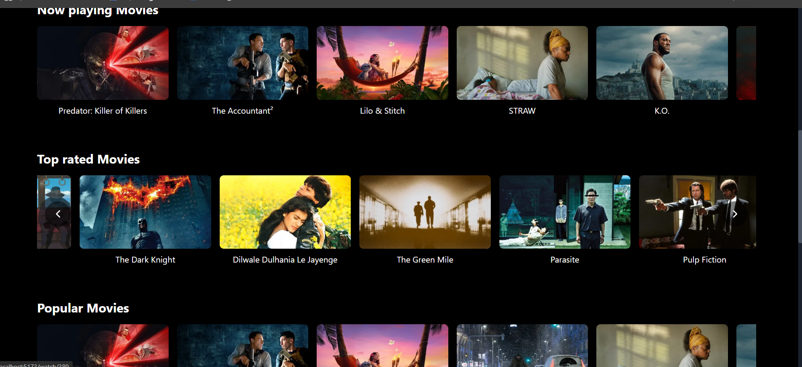
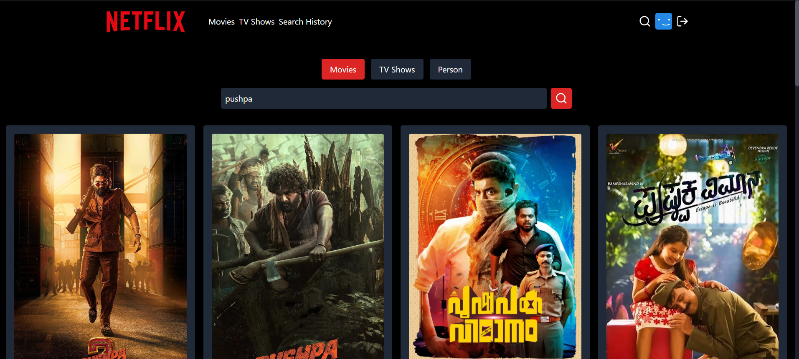
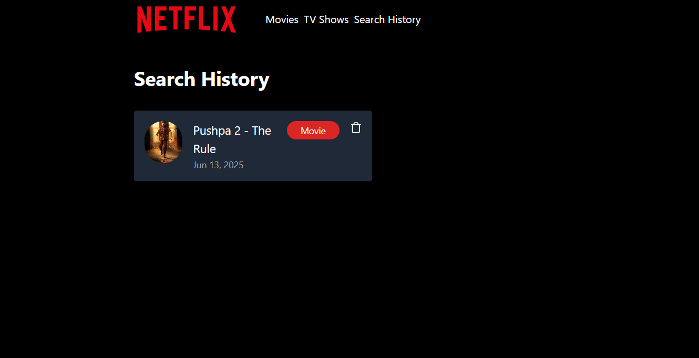
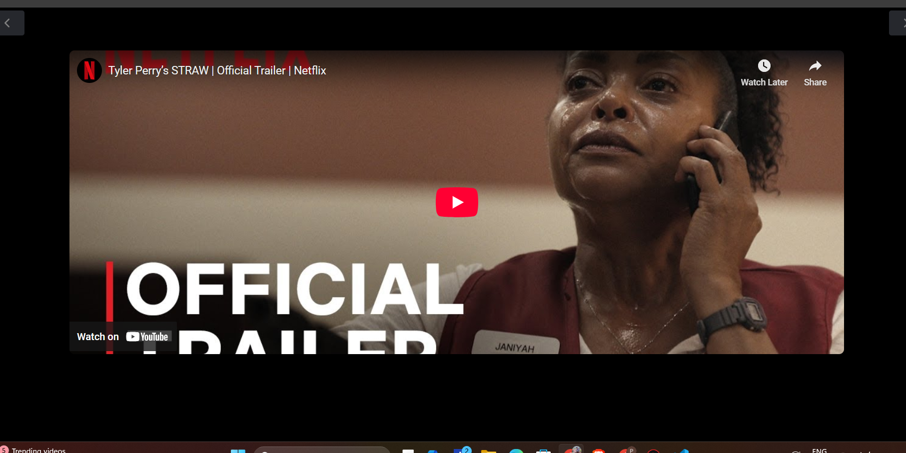
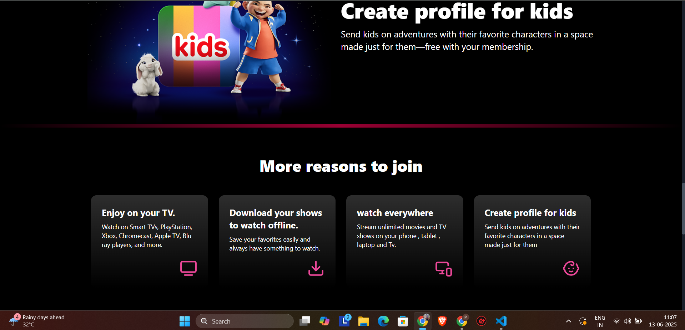
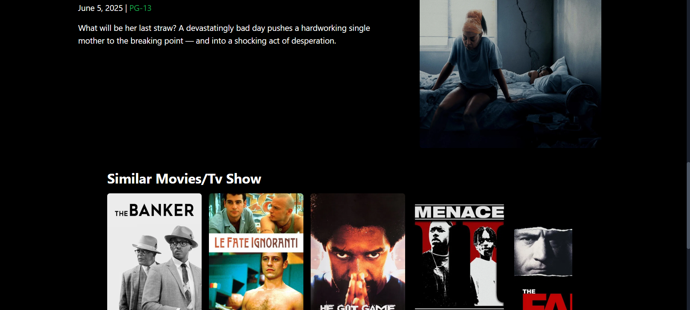

# 🎬 Netflix Clone

A responsive, feature-rich Netflix Clone built with MERN Stack (MongoDB, Express, React, Node.js).  
It includes real-time user authentication,not real time user verification it added soon, movie browsing, search functionality, and multi-language support — just like the real thing!

---

## ✨ Features

- 🔐 **Authentication**: Signup/Login with JWT
- 🌐 **Internationalization**: Multi-language support (English, Hindi, Bengali, etc.)
- 🎞️ **Trending Movies/TV Shows**: Fetched from TMDB API
- 🔍 **Search Functionality**: Search for content with autocomplete
- 📄 **Responsive Design**: Optimized for all devices
- 🧠 **Watchlist**: Coming Soon...
- ⚙️ **Fully Functional Backend** with REST API

---

## 🧪 Tech Stack

**Frontend**:  
- React  
- Tailwind CSS  
- i18next (for language support)  
- Axios  
- Vite

**Backend**:  
- Node.js  
- Express.js  
- MongoDB  
- JWT Authentication  
- TMDB API

---

## 📸 Screenshots

### 🏠 Home Page

### 🔐 Login Page

### 📝 Signup Page

### 🎥 Movie Section

### 🔍 Search Page

### ❓ Q&A / FAQ

### 📚 History Page

### 🎞️ Trailer View

### ➕ Features Section

### 🎯 Similar Suggestions

-------Thank You@@!!.......----